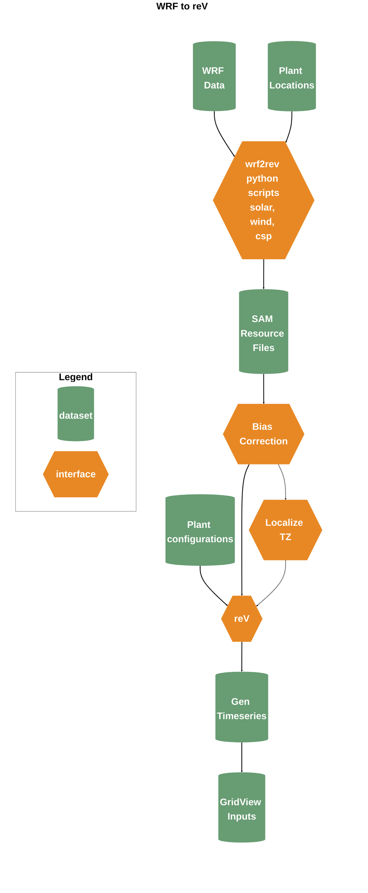

# WRF to reV 

Scripts for converting WRF output to reV input files (wind and solar) and formatting that output for GridView.

## Running the code 

The follwing steps will allow you to develop annual (8760) hourly solar and 
wind generation profiles from WRF output, and optionally format that output 
for GridView. 

### Setting up the rev python environment

Before anything else, follow the instructions 
[here](https://github.com/NREL/reV#installing-rev) for
setting up a conda environment with the appropriate packages for running reV. 
Additionally you will need to install the 
[wrf-python](https://wrf-python.readthedocs.io/en/latest/installation.html) and
[farms](https://github.com/NREL/farms) packages. 
Other package requirements are included in the repo-wide `requirements.txt`.

### Metadata
The metadata (`data/meta_{wind,solar}.csv`) contains information about each 
point location, name, lat, lon, elevation, etc. Metadata files are committed 
in this repo, but in case they need to be re-generated, please see the 
`meta.py` file as well as the README in the `sam/configs` directory. 

### Process WRF data 
The `wrf2rev_*.py` code should be run on PIC where the WRF data is stored. 
It can't be run on constance because of issues with python and the older centos
version but it can be run on deception/slurm or constance7a/slurm7. The repo 
includes sample SLURM scripts (`run_*.sl`) for deception. See below for how to 
set up a conda environment before any runs are made. See comments in the 
scripts for more details on how to run. 

The code can be run locally as well but one year of 3 hour data is hundreds of 
GB, so for testing it is possible to run just using 1 or two week-long netcdf 
files. In this case the SAM resource file will not work because SAM requires an
entire year of data to run.   

The data will be output into `data/sam_resource/wrf_{wind,solar}_1h_{year}.h5`.

### Download NSRDB and (optionally) WTK data
NSRDB data is required for bias correcting the solar radiation data (GHI) and 
is also necessary for validation. To run wind validation you'll also need some 
WTK data. To get both NSRDB and WTK data you'll need to 
[signup](https://developer.nrel.gov/signup/) for an API key. Once you have 
that, create a file named `.env` in the `WRF-to-reV` directory. The file 
should have the following lines:

    nrel_api_key = 'key'
    nrel_api_email = 'email'
    
Now run the `download_nsrdb.R` and (optionally) `download_nsrdb.R`. The 
working directory should be set to `WRF-to-reV/validation`. This scripts call 
the API once per point per year. Note that the NREL api has a limit of 5000 
annual point location files per day, which could be an issue if you need many 
points and many years. These files take a few hours to download. 

### Bias correct the solar data 
In PNNL's WRF data, GHI has shown some consistent bias with respect to the 
NSRDB. To fix this, some bias correction is necessary. If the NSRDB data has 
been downloaded simply run the `bias_correct.py` script. This will modify the 
data in the SAM resource (hdf5) files directly. 

### Convert to mountain time 
This step is only necessary if you plan on creating GridView input files. 

reV (SAM) is run 1 year at a time and so the input files contain only 1 year 
of data. At this point the reV input files have been created with years 
defined by UTC time. The script `data/convert_h5_to_mt.py` will read the data 
out of the existing hdf5 files and create new hdf5 file a `_mt` post fix. The 
working directory needs to be set to `data` when the script is run.

### Create generation profiles 
Now you are finally ready to run reV and create the generation profiles. The 
scripts `reV_solar.py` and `reV_wind.py` will create one csv file per year in 
`data/generation`. By default the scripts will output generation as a fraction
of total plant capacity. There is an option in the scripts to change the 
output to power (watts).

### Create GridView input files
As a final optional step, you can create GridView input files by running the 
script `convert_gen_for_gridview.R`, these will be output into 
`data/gridview_wind_solar_cf_8760`. 

## Validation
There are several more scripts and reports related to validating the met and gen data, please see the `README.md` in in the `validation` directory for more details. 
