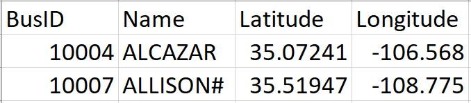
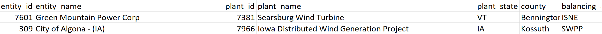

# reV Config File Generation
Scripts for generating .json configuration files for wind and solar generators for use in reV 

## Generating the config files
The configuration files will be output into subfolders `solar_configs` and `wind_configs` within the `configs` folder. Simply run the scripts `solar_config_generation.py` and `wind_config_generation.py`, which will populate the `solar_configs` and `wind_configs` folders with the configuration files. The naming convention for the configuration files is `{ID number}_sam_configs.json`. Constants that are part of the config files (i.e. 'losses' for solar or 'wind_farm_losses_percent' for wind) can be changed at the bottom (in the last 20 lines) of the `solar_config_generation.py` and `wind_config_generation.py` scripts, where the dictionary that is written into the json file is formed.

## Methodology for processing the data
* Import generator inventory for initialization year
   * Example generator inventory: 
      * 
   * Filters
      * Desired technology (i.e. wind/solar) only
      * In service only
      * US only
* Import Bus data file and joint to generator inventory in order to add coordinates
* Example bus data file: 
   *  
* Import EIA ‘steel in ground’ plants and generators databases
   * Example EIA database: 
      * 
   * Filters
      * WECC only
* Create column in EIA database called ‘LongID’ which is a combination of the state, plant id, and generator id, in the format state-plant_id-generator_id
   * Example: 
      * 
* Join EIA database to generatory inventory on LongID (generator inventory should already have LongID column)
* Separate combined table into generators that had a LongID match (`hw_matched`) and those that didn’t (`hw_unmatched`)
* We will match our starting generator inventory with the EIA database using three approaches
   * METHOD 1: LongID
      * Join EIA database to `hw_unmatched` using the potential LongID that was created
   * METHOD 2: Name matching
      * Use fuzzywuzzy to find EIA generators with a plant_name that is similar to the GeneratorName in the generator inventory
      * This requires a ‘threshold’ name similarity to consider it a match – after trial and error, it was determined that 75 was the best value to find all possible matches while eliminating false matches
      * Add a filter for the distance from the generator to the EIA plant using the `geodesic` function from the `geopy.distance` module in order to eliminate false name matches (i.e. if the names are similar but the plants are 1000 miles apart, they aren’t actually a match)
   * METHOD 3: Distance matching
      * Use geodesic to calculate the distance between the generator in the inventory and the EIA generator, if the coordinates are available for both
      * If the closest EIA generator was within 100 miles, it is considered a potential match
      * Add a filter for name similarity
         * Intended to filter out potential matches found that are clearly incorrect (i.e. generator in inventory is named "Black Mountain" but the EIA generator that is closest is named "White River")
         * A threshold of 60 was determined to be suitable for this, as it allows some leniency for different naming conventions, but removes matches with completely different names
* Export the database containing the match information from all three matching methods
* MANUALLY edit the table to determine the correct corresponding EIA plant for each generator
   * In some cases two or more of the three methods will agree with each other on what the correct plant is, and the match is considered correct
   * In some cases, none of the methods resulted in a match, or none of the methods agree with each other. In this case, manually compare the generator in the inventory to the EIA plants to determine if a correct match can be found. If so, manually input the plant_id for the match.
      * Method for manual matching
         * Search EIA database for names that could be the same as the generator in the inventory
            * For example, some generators in the inventory might have all vowels stripped or be shortened (i.e. MTN vs. Mountain), which prevents the name matching method from correctly identifying a match
         * If coordinates are available, look for generators in the EIA database with similar coordinates
         * If neither of the above steps reveal a match, Google the name to determine if the plant may go by multiple names
         * Lastly, if a potential match has been found, compare the listed capacities of the generators in the initial inventory and the EIA database to verify that it's the same generator
* Import the manually fixed table for further processing
* Now that all the possible matches have been determined, join the EIA database to the initial generator inventory using the Plant ID from the EIA database that was determined from the matching process
* In some cases, one plant in the EIA database is split into multiple entries. For these entries, we will select the EIA entry with a capacity that is closest to the capacity of the generator
   * For example, Plant ID 12345 might have one entry in the EIA database at 100 MW and one at 200 MW
      * If the generator in the initial inventory corresponding to plant ID 12345 is 100 MW, selelect the 100 MW entry
   * In most cases, this results in an exact or nearly exact capacity match
* Rejoin the table of generators that were originally matched (`hw_matched`) to the processed `hw_unmatched` table
* We now have matched all the generators to their corresponding EIA generators, if there is a possible match
* Separate table into two categories: generators that have a match and those that don't
   * Analysis will continue ONLY with the matched generators, unmatched generators will not be analyzed further 

### Solar Specific Steps
* The array type, module type, tilt angle, and azimuth angle must be determined
   * Module type
      * If 'Fixed Tilt?' is 'Y', module type is Fixed rack and set to 0
      * If 'Single-Axis Tracking?' is 'Y', module type is 1-Axis and set to 2
      * If 'Dual-Axis Tracking?' is 'Y', module type is 2-Axis and set to 4
      * If there is no listed module type default to fixed rack and set to 0
   * Tilt angle
      * If 'Tilt Angle' has a value, use that
      * If not, set tilt angle to be the Latitude of the generator
   * Array type
      * If any of the columns titled 'Thin Film {}?' have 'Y' as the value, array type is thin film and set to 2
      * Otherwise, array type is standard and set to 0
   * Azimuth
      * If 'Azimuth Angle' has a value use that
      * If not, set tilt angle to be 180
* A json file is generated for each generator that has all of the parameters needed as inputs for the config file
   * This is where constant values, such as 'dc_ac_ratio' or 'losses', may be changed
* The json file is named as {Generator ID}_sam_configs.json and is saved in the subfolder solar_configs

### Wind Specific Steps
* Join the EIA models table, which contains the wind turbine model name, in order to get wind turbine specifications
   * The EIA generators table and the EIA models table use different naming conventions for their models (‘major_t_model’ in generators table and ‘model’ in models table)
      * To account for this, a model name key (eia_model_matching_full.csv) was developed which shows each ‘major_t_model’ with its corresponding ‘model’ name
      * Use the key to get the correct ‘model’ name for each generator, and then join the EIA models table to the generators
* The EIA power curves table must be joined to the generator inventory to obtain the wind turbine power curves
   * Use the power curve table that has been reformatted using powercurve_formatting.py, in order to compile the speed and power curves into one single entry for each model rather than an entry for each speed and power (eia_power_curve_fixed)
   * Join on model name
* There are not power curves available for every model – for models with no powercurves, use the function power_curve_generation from power_curve_generation.py to generate power curves for the remaining models
   * This function uses the cut-in wind speed, rated wind speed, rated power, and cut-out wind speed in order to generate a power curve
* The wind farm coordinates (i.e. the coordinates of each individual turbine within a wind farm) must be joined to obtain the coordinates of each generator in the inventory
   * Similar to the power curves, use the coordinate table that has been reformatted using eerscmap_formatting.py, in order to compile the coordinate lists into one single entry for each generator rather than an entry for each turbine (eia_eerscmap_fixed.csv)
   * Join on plant id
   * There are many EIA plant ids that have multiple different models or coordinate lists for one single plant ID
      * To account for this, MANUALLY go through table after matching to select the most appropriate set of coordinates for each generator
         * The most appropriate set of coordinates is the list of coordinates with the number of entries closest to the n_turbines column in the existing database
         * Any plant ids that have no coordinates are set as one single turbine at (0,0), as reV requires a coordinate input
* Lastly, columns must be converted into the correct units for the reV config file, and columns are renamed to the correct name for the config file
* A json file is generated for each generator that has all of the parameters needed as inputs for the config file
   * This is where constants such as 'turb_generic_losses' or 'wind_resource_shear' can be changed
* The json file is named as {Generator ID}_sam_configs.json and is saved in the subfolder wind_configs
